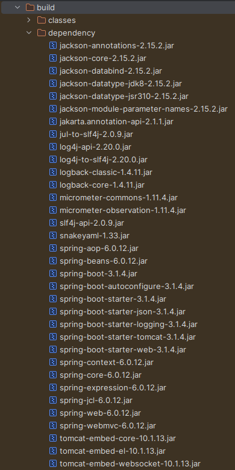
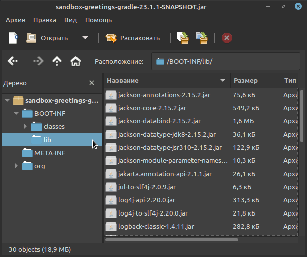
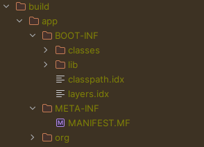
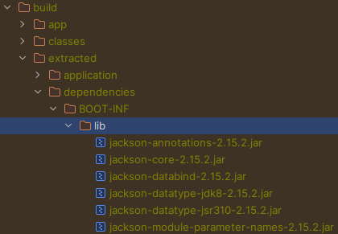

= Контейнеризация приложений Spring Boot с Gradle
:toc:

Разработку и развёртывание современного серверного программного обеспечения невозможно представить себе без использования контейнеров, тем более, когда речь идёт о развёртывании в Kubernetes.
В этой статье я продемонстрирую несколько вариантов того, как можно упаковать Gradle-проект на основе Spring Boot в контейнер в формате OCI (Open Container Initiative), ну или попросту в Docker-контейнер.

== Необходимые инструменты

Для выполнения сборки проекта и OCI-образов вам потребуется:

- OpenJDK 17+ (протестировано на BellSoft Liberica OpenJDK 17.0.9)
- Gradle 8.2.1+ (протестировано на Grade 8.5)
- Docker (протестировано на Docker 24.0.6)

Все примеры протестированы на Linux Mint 21.2 Victoria и Ubuntu 22.04.3 LTS, но так же должны работать и на других операционных системах.

== Подготовка проекта к упаковке в контейнер

Для упаковки приложения в контейнер потребуются все файлы, используемые приложением во время исполнения, и в случае с проектом на платформе Java в целом нам потребуются скомпилированные class-файлы проекта, различные ресурсы (конфигурационные yaml-файлы, html-страницы, изображения и т.д.), а так же jar-архивы с библиотеками.

При использовании Gradle скомпилированные class-файлы мы можем взять из директории `build/classes/java/main`, ресурсы - из `src/main/resources`, в то время как jar-файлы библиотек лежат в локальном репозитории Maven (`.m2/repository` в домашней директории пользователя), и нам их нужно скопировать в одну директорию для упрощения работы с ними.
Предлагаю рассмотреть два варианта копирования библиотек: при помощи Gradle и при помощи Spring Boot Gradle Plugin.

=== Копирование зависимостей при помощи Gradle

Для копирования зависимостей потребуется добавить в `build.gradle.kts` соответствующую задачу:

.build.gradle.kts
[source,kotlin]
----
tasks.register<Copy>("downloadLibs") {
    from(configurations.named("runtimeClasspath"))
    into {
        project.layout.buildDirectory.dir("dependency")
    }
}
----

Собрать проект и скопировать необходимые для запуска зависимости можно при помощи команды:

[source,shell]
----
gradle build downloadLibs
----

Результатом выполнения этой команды будет собранный проект с директорией `build/dependency` со всеми зависимостями, требуемыми во время выполнения:

.Зависимости проекта

Теперь, когда у вас есть классы и ресурсы вашего проекта, а так же все необходимые зависимости, вы можете их все вместе собрать в одной директории и произвести тестовый запуск приложения:

[source,shell]
----
mkdir build/application
cp build/libs/sandbox-greetings-gradle-23.1.1-SNAPSHOT-plain.jar build/application/application.jar
cp -r build/dependency build/application/lib
cd build/application
java -cp lib/*:application.jar pro.akosarev.sandbox.GreetingsGradleApplication
----

Обратите своё внимание на суффикс `-plain` в имени файла - в данной ситуации мы работаем с обычным JAR-файлом, а не "толстым" JAR-файлом, который собирается при помощи Spring Boot Gradle Plugin, о чём будет рассказано ниже.

Альтернативно вы можете скопировать вместо jar-архива вашего проекта директории `build/classes/java/main` и `src/main/resources`, тогда копирование и запуск приложения будут выглядеть так:

[source,shell]
----
mkdir build/application
cp -r build/classes/java/main/* build/application
cp -r src/main/resources/* build/application
cp -r build/dependency build/application/lib
cd build/application
java -cp lib/*:. pro.akosarev.sandbox.GreetingsGradleApplication
----

Примерно те же действия вам нужно будет выполнить при описании образа.

== Сборка образа

Теперь можно перейти к написанию Dockerfile для образа нашего проекта:

.gradle-prebuilt.Dockerfile
[source,dockerfile]
----
# При помощи ключевого слова FROM необходимо указать исходный образ,
# который мы будем использовать для создания своего.
# Для данного примера выбран образ на основе Debian с установленным
# Liberica OpenJDK 17 версии, поскольку нам он нужен для запуска приложения.
FROM bellsoft/liberica-openjdk-debian:17

# Желательно запускать приложения не от имени суперпользователя, который
# используется по умолчанию, поэтому нужно создать пользователя и группу
# для запуска приложения.
RUN addgroup spring-boot-group && adduser --ingroup spring-boot-group spring-boot
USER spring-boot:spring-boot-group

# Иногда требуется получить доступ к файлам, генерирующимся в процессе выполнения,
# для этого зарегистрируем том /tmp
VOLUME /tmp

# Со временем у проекта будет изменяться версия, и чтобы не изменять всякий раз
# этот Dockerfile имя jar-файла вынесем в аргумент.
ARG JAR_FILE=sandbox-greetings-gradle-23.1.1-SNAPSHOT-plain.jar

# Создадим рабочую директорию проекта
WORKDIR /application

# Скопируем в рабочую директорию проекта JAR-файл проекта и его зависимости
COPY build/libs/${JAR_FILE} application.jar
COPY build/dependency lib

# В конце укажем точку входа. Выбран вариант с использованием exec для того, чтобы
# можно было передать в строку запуска дополнительные параметры запуска - JAVA_OPTS, а так же
# ${0} и ${@} для передачи аргументов запуска.
ENTRYPOINT exec java ${JAVA_OPTS} -cp lib/*:application.jar pro.akosarev.sandbox.GreetingsGradleApplication ${0} ${@}
----

Теперь мы можем собрать OCI-образ при помощи Docker:

[source,shell]
----
docker build -t sandbox-greetings-gradle:23.1.1-prebuilt --file gradle-prebuilt.Dockerfile .
----

При помощи аргумента `-t` задаётся тэг для собираемого образа, при помощи `--file` - Dockerfile для сборки, а точка в конце указывает на то, что в качестве сборочной директории нужно использовать текущую, в ней должен находиться Dockerfile.

Результат успешной сборки образа должен выглядеть примерно следующим образом:

[source,shell]
----
$ docker build -t sandbox-greetings-gradle:23.1.1-prebuilt --file gradle-prebuilt.Dockerfile .
[+] Building 8.3s (10/10) FINISHED                                                                                 docker:default
 => [internal] load .dockerignore                                                                                            0.0s
 => => transferring context: 2B                                                                                              0.0s
 => [internal] load build definition from prebuilt.Dockerfile                                                                0.0s
 => => transferring dockerfile: 2.44kB                                                                                       0.0s
 => [internal] load metadata for docker.io/bellsoft/liberica-openjdk-debian:17                                               1.3s
 => [1/5] FROM
docker.io/bellsoft/liberica-openjdk-debian:17@sha256:9c2ebedadec0e97d2c1510aadff9570bdcb33004d0b4d0f51476f45ab134d29f        3.6s
 => => resolve
docker.io/bellsoft/liberica-openjdk-debian:17@sha256:9c2ebedadec0e97d2c1510aadff9570bdcb33004d0b4d0f51476f45ab134d29f        0.0s
 => => sha256:124f8fa7aebad43db7aef2bf128967dcb5b36e7da18c35d6ef194a9d5c2a941f 13.84kB / 13.84kB                             0.0s
 => => sha256:69b3efbf67c2d9a46fdfdc8480b5a03ef73e9999a53aad57213447784f01eb6e 55.06MB / 55.06MB                             1.5s
 => => sha256:cb448045306f3ed922772e14159297b28bfc5fcb035ecb73fd9318652179e7f8 15.86MB / 15.86MB                             1.1s
 => => sha256:9841a28f43758d9ecdc4a26d9d748fc841d105dc8102ee782bb9beee2db0ae5a 86.28MB / 86.28MB                             3.0s
 => => sha256:9c2ebedadec0e97d2c1510aadff9570bdcb33004d0b4d0f51476f45ab134d29f 770B / 770B                                   0.0s
 => => sha256:8c62ce652dcb7a77a9b1aa7b2df33fa09f5d559a54882de85ebc01b58ca838a6 954B / 954B                                   0.0s
 => => extracting sha256:69b3efbf67c2d9a46fdfdc8480b5a03ef73e9999a53aad57213447784f01eb6e                                    0.9s
 => => extracting sha256:cb448045306f3ed922772e14159297b28bfc5fcb035ecb73fd9318652179e7f8                                    0.3s
 => => extracting sha256:9841a28f43758d9ecdc4a26d9d748fc841d105dc8102ee782bb9beee2db0ae5a                                    0.4s
 => [internal] load build context                                                                                            0.1s
 => => transferring context: 18.89MB                                                                                         0.1s
 => [2/5] RUN addgroup spring-boot-group && adduser --ingroup spring-boot-group spring-boot                                  1.5s
 => [3/5] WORKDIR /application                                                                                               0.1s
 => [4/5] COPY build/libs/sandbox-greetings-gradle-23.1.1-SNAPSHOT-plain.jar application.jar                                 0.1s
 => [5/5] COPY build/dependency lib                                                                                          0.1s
 => exporting to image                                                                                                       0.1s
 => => exporting layers                                                                                                      0.1s
 => => writing image sha256:4dfa5b0aa45912899bc13116f72879adf5cd5eaea80c3bec200252d906cc0200                                 0.0s
 => => naming to docker.io/library/sandbox-greetings-gradle:23.1.1-prebuilt
----

Теперь мы можем создать и запустить контейнер из нашего образа:

[source,shell]
----
docker run --name sandbox-greetings-gradle sandbox-greetings-gradle:23.1.1-prebuilt
----

Остановить и удалить контейнер мы можем при помощи `docker stop` и `docker rm`:

[source,shell]
----
docker stop sandbox-greetings-gradle
docker rm sandbox-greetings-gradle
----

Так же мы можем передавать параметры для приложения через переменные окружения и аргументы:

[source,shell]
----
docker run --name sandbox-greetings-gradle: -e SERVER_PORT=8081 sandbox-greetings-gradle:23.1.1-prebuilt --spring.profiles.active=sandbox
----

В данном примере я задал HTTP-порт 8081 и активный профиль sandbox.

На данном этапе полная сборка проекта в образ состоит из двух команд:

[source,shell]
----
gradle clean build downloadLibs
docker build -t sandbox-greetings-gradle:23.1.1-prebuilt --file gradle-prebuilt.Dockerfile .
----

Однако сборку образа мы можем сократить до одной команды `docker build ...`, переместив сборку gradle-проекта тоже в Docker!
Очевидная выгода от такого решения заключается в отсутствии необходимости в Gradle и JDK на компьютере, достаточно будет только Docker.
Для этого в самое начало нашего Dockerfile нужно дописать следующие строки:

[source,dockerfile]
----
# На этот раз нам требуется образ, содержащий Gradle, при помощи
# ключевого слова as мы указываем псевдоним для контейнера сборки,
# чтобы при его помощи в дальнейшем обращаться к контейнеру
FROM gradle:8-jdk17 as build

# Собирать проект будем в /build
WORKDIR /build

# Теперь необходимо скопировать необходимые для сборки проекта файлы в конейнер
COPY src src
COPY build.gradle.kts build.gradle.kts
COPY settings.gradle.kts settings.gradle.kts

# И запустить сборку проекта. Загружаемые библиотеки желательно кэшировать между
# сборками,для этого нужно добавить --mount=type=cache,target=/root/.m2 к RUN
RUN --mount=type=cache,target=/root/.m2 gradle clean build downloadLibs
----

После этого нужно внести изменения в копирование файлов собранного проекта:

[source,dockerfile]
----
COPY --from=build /build/build/libs/${JAR_FILE} application.jar
COPY --from=build /build/build/dependency lib
----

Весь Dockerfile теперь выглядит следующим образом (комментарии опущены):

.gradle-full.Dockerfile
[source,dockerfile]
----
FROM gradle:8-jdk17 as build
WORKDIR /build
COPY src src
COPY build.gradle.kts build.gradle.kts
COPY settings.gradle.kts settings.gradle.kts
RUN --mount=type=cache,target=/root/.m2 gradle clean build downloadLibs

FROM bellsoft/liberica-openjdk-debian:17
RUN addgroup spring-boot-group && adduser --ingroup spring-boot-group spring-boot
USER spring-boot:spring-boot-group
VOLUME /tmp
ARG JAR_FILE=sandbox-greetings-gradle-23.1.1-SNAPSHOT.jar
WORKDIR /application
COPY --from=build /build/build/libs/${JAR_FILE} application.jar
COPY --from=build /build/build/dependency lib
ENTRYPOINT exec java ${JAVA_OPTS} -cp lib/*:application.jar pro.akosarev.sandbox.GreetingsGradleApplication ${0} ${@}
----

Теперь OCI-образ собирается одной командой:

[source,shell]
----
docker build -t sandbox-greetings-gradle:23.1.1 --file gradle-full.Dockerfile .
----

Полученный образ не отличается скромными размерами, и в моём случае его размер получается почти 300Мб!
Вы можете поэкспериментировать с используемыми JDK и JRE в основном образе, так замена `bellsoft/liberica-openjdk-debian:17` на `ubuntu/jre:17_edge` уменьшает размер образа до 170Мб.

== Spring Boot Gradle Plugin и "толстый" JAR

Spring Boot Gradle Plugin добавляет задачу для сборки "толстого" JAR-файла, который содержит не только классы и ресурсы вашего проекта, но и все зависимости, необходимые для его запуска.

При использовании "толстого" JAR вам достаточно скопировать итоговый JAR-файл в образ и запустить его:

.gradle-fatjar.Dockerfile
[source,dockerfile]
----
FROM gradle:8-jdk17 as build
WORKDIR /build
COPY src src
COPY build.gradle.kts build.gradle.kts
COPY settings.gradle.kts settings.gradle.kts
RUN --mount=type=cache,target=/root/.m2 gradle clean build downloadLibs

FROM bellsoft/liberica-openjdk-debian:17
RUN addgroup spring-boot-group && adduser --ingroup spring-boot-group spring-boot
USER spring-boot:spring-boot-group
VOLUME /tmp
ARG JAR_FILE=sandbox-greetings-gradle-23.1.1-SNAPSHOT.jar
WORKDIR /application
COPY --from=build /build/build/libs/${JAR_FILE} application.jar

# В случае с "толстым" JAR-архивом мы можем запускать приложение при помощи java -jar
ENTRYPOINT exec java ${JAVA_OPTS} -jar application.jar ${0} ${@}
----

Однако для ускорения запуска приложения вы можете распаковать его.

.Содержимое "толстого" JAR-архива проекта

Распаковать этот JAR-архив можно при помощи команды:

[source,shell]
----
mkdir -p build/app
cd build/app
jar -xf ../libs/sandbox-greetings-gradle-23.1.1-SNAPSHOT.jar
----

В результате чего в директории `build/app` будут находиться все файлы из архива, а зависимости - в директории `build/app/BOOT-INF/lib`:

Теперь собрать OCI-образ, аналогичный тому, что я собирал без использования "толстого" JAR, можно следующим образом:

.gradle-fatjar-unpacked.Dockerfile
[source,dockerfile]
----
FROM gradle:8-jdk17 as build
WORKDIR /build
COPY src src
COPY build.gradle.kts build.gradle.kts
COPY settings.gradle.kts settings.gradle.kts

# Чтобы не создавать лишние промежуточные слои, я объединяю команды в одну при помощи &&

RUN --mount=type=cache,target=/root/.m2 \
    gradle clean build && \
    mkdir -p build/app && \
    cd build/app && \
    jar -xf ../libs/sandbox-greetings-gradle-23.1.1-SNAPSHOT.jar

FROM bellsoft/liberica-openjdk-debian:17
RUN addgroup spring-boot-group && adduser --ingroup spring-boot-group spring-boot
USER spring-boot:spring-boot-group
VOLUME /tmp
WORKDIR /application
COPY --from=build /build/build/app/BOOT-INF/lib lib
COPY --from=build /build/build/app/META-INF ./META-INF
COPY --from=build /build/build/app/BOOT-INF/classes .
ENTRYPOINT exec java ${JAVA_OPTS} -cp lib/*:. pro.akosarev.sandbox.GreetingsGradleApplication ${0} ${@}
----

=== Spring Boot: слои и JarLauncher

Ещё один альтернативный способ запуска приложения, доступный нам при использовании Spring Boot Gradle Plugin - загрузка через JarLauncher.
Кроме этого Spring Boot имеет встроенную поддержку слоёв, использование которых может сделать сборку Docker-образов более эффективной.
Распаковать "толстый" JAR-архив с использованием слоёв можно при помощи команды:

[source,shell]
----
java -Djarmode=layertools -jar build/libs/sandbox-greetings-gradle-23.1.1-SNAPSHOT.jar extract --destination build/extracted
----

В результате мы получим в директории `build/extracted` директории, соответствующие четырём слоям:

- `application` - файлы нашего проекта
- `dependencies` - runtime-зависимости проекта
- `snapshot-dependencies` - SNAPSHOT-зависимости проекта
- `spring-boot-loader` - файлы загрузчика Spring Boot

.Распакованные слои

Для запуска приложения нужно будет скопировать все четыре директории и выполнить команду:

[source,shell]
----
java org.springframework.boot.loader.JarLauncher
----

В Dockerfile это всё будет выглядеть следующим образом:

.gradle-fatjar-extracted.Dockerfile
[source,dockerfile]
----
FROM gradle:8-jdk17 as build
WORKDIR /build
COPY src src
COPY build.gradle.kts build.gradle.kts
COPY settings.gradle.kts settings.gradle.kts

RUN --mount=type=cache,target=/root/.m2 \
    gradle clean build && \
    java -Djarmode=layertools \
    -jar build/libs/sandbox-greetings-gradle-23.1.1-SNAPSHOT.jar \
    extract --destination build/extracted

FROM bellsoft/liberica-openjdk-debian:17
RUN addgroup spring-boot-group && adduser --ingroup spring-boot-group spring-boot
USER spring-boot:spring-boot-group
VOLUME /tmp
WORKDIR /application
COPY --from=build /build/build/extracted/application .
COPY --from=build /build/build/extracted/dependencies .
COPY --from=build /build/build/extracted/snapshot-dependencies .
COPY --from=build /build/build/extracted/spring-boot-loader .
ENTRYPOINT exec java org.springframework.boot.loader.JarLauncher ${0} ${@}
----

== Spring Boot Gradle Plugin и сборка образов

Spring Boot Gradle Plugin также предоставляет возможность собрать OCI-образ при помощи https://buildpacks.io/[Cloud Native Buildpacks], в этом случае вам даже не нужен Dockerfile.
Сборка образа осуществляется при помощи команды:

[source,shell]
----
gradle bootBuildImage
----

Настроить параметры собираемого образа можно при помощи параметров https://docs.spring.io/spring-boot/docs/3.1.4/gradle-plugin/reference/htmlsingle#build-image.customization[Spring Boot Gradle Plugin]:

[source,kotlin]
----
tasks.named<BootBuildImage>("bootBuildImage") {
    // Имя образа
    imageName = "sandbox-greetings-gradle"

    // Список используемых Buildpacks
    buildpacks.add("paketobuildpacks/ca-certificates:3.6.3")
    buildpacks.add("paketobuildpacks/bellsoft-liberica:10.4.0")
    buildpacks.add("paketobuildpacks/syft:1.32.1")
    buildpacks.add("paketobuildpacks/executable-jar:6.7.4")
    buildpacks.add("paketobuildpacks/dist-zip:5.6.4")
    buildpacks.add("paketobuildpacks/spring-boot:5.26.1")

    // Список пробрасываемых директорий в Buildpacks
    bindings.add("${projectDir}/platform/bindings:/platform/bindings")
}
----

В указанном примере я указал своё название образа, хотя в данном случае это не обязательно, т.к. оно соответствует названию проекта.
Так же я изменил список используемых Buildpacks, т.к. мне нужна была версия `packetobuildpacks/bellsoft-liberica` 10.4.0, а не 10.2.6, но несмотря на то, что изменения касаются только одного Buildpack, указывать нужно их все.
Так же я при помощи `<bindings>` прокинул локальную директорию с самоподписанным CA-сертификатом в контейнер сборки, чтобы в дальнейшем приложение могло использовать защищённые соединения.